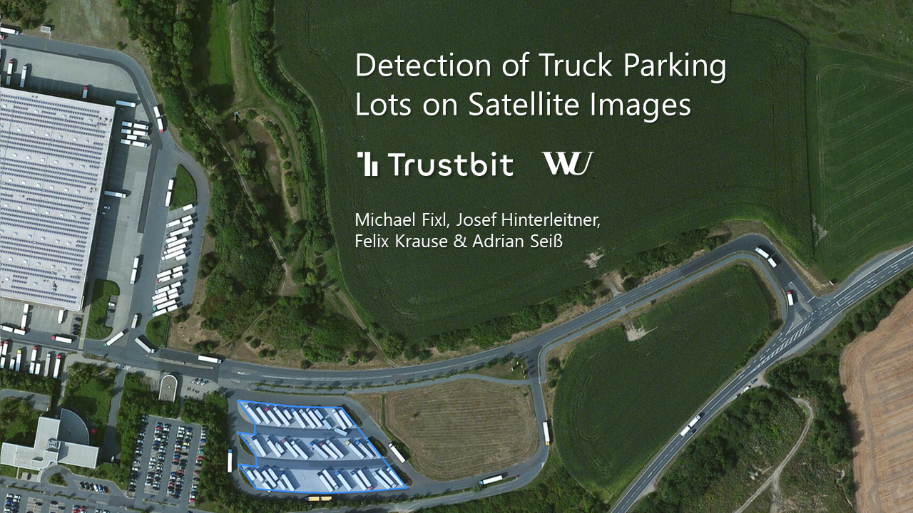

# Overview

This repository is based on a project conducted by Michael Fixl, Josef Hinterleitner, [Felix Krause](https://www.linkedin.com/in/felix-krause-7a643b222) and [Adrian Seiß](https://www.linkedin.com/in/adrian-sei%C3%9F) at the Vienna University of Economics and Business in collaboration with [Trustbit](https://trustbit.tech/).

 
The notebooks above perform the following tasks:

0. Script to manually filter satellite images and labels based on a list of coordinates (of GeoPandas polygon type)
1. Combine several white- and blacklists from manual filtering to one csv containing coordinates and an unique id
2. Create training data for object detection (XML file with pixel values of bounding box; object detection not in this repo yet)
3. Create training data for polygonal labels
    1. Save information in one JSON (necessary for instance segmentation with e.g. Mask R-CNN, not included in this repo)
    2. Save information as masks (necessary for algorithms of [Segmentation Models API](https://github.com/qubvel/segmentation_models))
4. Train image segmentation models (U-Net, Linknet, FPN and PSPNet) in a simple baseline setting
5. Optimize the best performing model of notebook 4.
6. Final function, where one can enter coordinates (of a parking lot), and the function returns the (visual) parking lot prediction for this location

 

 

Data sources and references:

- Coordinate data from OpenStreetMap
- Satellite imagery from the Esri satellite, [World Imagery](https://www.arcgis.com/home/item.html?id=10df2279f9684e4a9f6a7f08febac2a9#!)
- Code snippets from Dr. Vadim Savenkov
- Image segmentation training notebooks adapted from [Dr. Sreenivas Bhattiprolu](https://github.com/bnsreenu/python_for_microscopists/tree/master/228_semantic_segmentation_of_aerial_imagery_using_unet)
- Image segmentation models via [Segmentation Models API](https://github.com/qubvel/segmentation_models)

 

Please conform to the license applied.